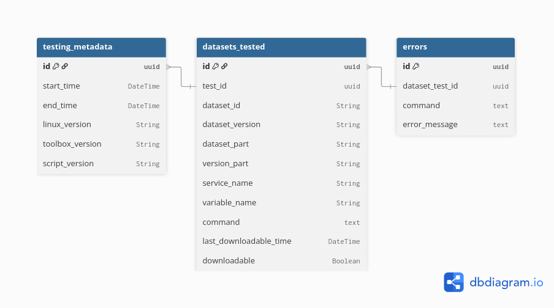

# Database Schema and Usage
Currently, the database contains two schema: 

- A simple one with a single table with rows describing each download attempt, including errors. This one is rigid and can only contain three errors.

- A more complex one with three tables: One containing the main information to reproduce a serie of tests ( OS used, version of the toolbox, version of the script, dates of execution), one containing all the datasets that have been tested, the service, version and variables that have been tested and if they were downloadable during the runs and one containing the errors associated with the datasets. The tables are linked between them via uuid (https://developer.mozilla.org/en-US/docs/Glossary/UUID). The collection of tests has a uuid, which is used as a foreign key in the datasets table to connect it with the first table, and each row of the dataset table has another uuid, which are used as foreign keys in the error table.

## To connect:

Both the schema are on the same database. You will need information given in the readme of the database present in the project "project-test-datasets-subsetting-toolbox". The following command will ask a password that will also be given in the readme of the database.

```bash
psql -h HOST -p PORT -U USERNAME -d DATABASE_NAME
```

## List tables:

There should be four tables:
- **"List_of_datasets"** ( the '"' are necessary to access this table). This is the table of the simple schema.
- **testing_metadata** containing the information about the test conditions.
- **datasets_tested** containing the informations about the datasets tested.
- **errors** containg the different errors.

### Tables columns:

**List_of_datasets**:
-id: UUID associated with each dataset (**uuid**)
-dataset_id: Dataset identifier as can be used in the copernicusmarine toolbox (**String**)
-dataset_version: Version of the dataset (**String**)
-version_part: Part of the version tested (**String**)
-service_name: Name of the service tested (**String**)
-variable_name: Variable tested (**String**)
-has_time_coordinate: Presence of time coordinate for the variable (**Boolean**)
-last_available_time: Last available time for which there is data from the describe command (**String**)
-region: Region of the dataset (**String**)
-downloadable: If the dataset was downloadable (**Boolean**)
-last_downloadable_time: Last available time for which there is from the subset command (**String**)
-first_command: Command launched for the first try (**String**)
-first_error: (Optional) Error if the first try did not work (**String**)
-second_command: (Optional) Command launched for the second try (**String**)
-second_error: (Optional) Error if the second try did not work (**String**)
-third_command: (Optional) Command launched for the third try (**String**)
-third_error: (Optional) Error if the third try did not work (**String**)

**testing_metadata**
-id: UUID associated which each run of the script (**uuid**)
-start_time: Time of the start of the script's run (**DateTime**)
-end_time: Time of the end of the script's run (**DateTime**)
-linux_version: Version of the OS used for the run (**String**)
-toolbox_version: Version of the toolbox used for the run (**String**)
-script_version: Version of the script used for the run (**String**)

**datasets_tested**
-id: UUID associated with each dataset tested, not the same as the id of **testing_metadata** (**uuid**)
-test_id: Foreign key connecting to the testing_metadata table, **same as the id of testing_metadata for the run** (**uuid**)
-dataset_id: Identifier of the dataset as used with the copernicusmarine toolbox (**String**)
-dataset_version: Version of the dataset (**String**)
-version_part: Part of the version tested (**String**)
-service_name: Name of the service tested (**String**)
-variable_name: Variable tested (**String**)
-command: Command launched for the first try (**Text**)
-last_downloadable_time: Last available time for which there is from the subset command (**DateTime**)
-downloadable: If the dataset was downloadable (**Boolean**)

**errors**
-id: UUID associated with each error, not the same as the id of **datasets_tested** or **testing_metadata** (**uuid**)
-dataset_test_id: Foreign key connecting to the datasets_tested table, **same as the id of datasets_tested for the dataset** (**uuid**)
-command: Command associated for the error (**Text**)
-error_message: Message associated with the error (**Text**)

The relationships between the tables is summarized in the following schema:




## Consulting tables
### Simple consultation
You can see the list of tables, once connected, with the following command:
```bash
\dt
```

You can look a bit better at the tables with the following commands. To see the first ten rows for example:

```bash
SELECT * FROM my_table LIMIT 10;
```

Or the last ten rows:

```bash
SELECT * FROM my_table ORDER BY id DESC LIMIT 10;
```

### Consultation of complex schema

If you want to consult the errors associated with a given run, you can run the following command, with <RUN_ID> replaced by the id found the in the table **testing_metadata**:

````bash
SELECT 
    tm.id AS run_id,
    tm.start_time,
    tm.end_time,
    dt.dataset_id,
    dt.dataset_version,
    dt.version_part,
    dt.service_name,
    dt.variable_name,
    e.id AS error_id,
    e.command AS error_command,
    e.error_message
FROM testing_metadata tm
JOIN datasets_tested dt 
    ON tm.id = dt.test_id
JOIN errors e 
    ON dt.id = e.dataset_test_id
WHERE tm.id = <RUN_ID>
ORDER BY dt.dataset_id, e.id;
````
